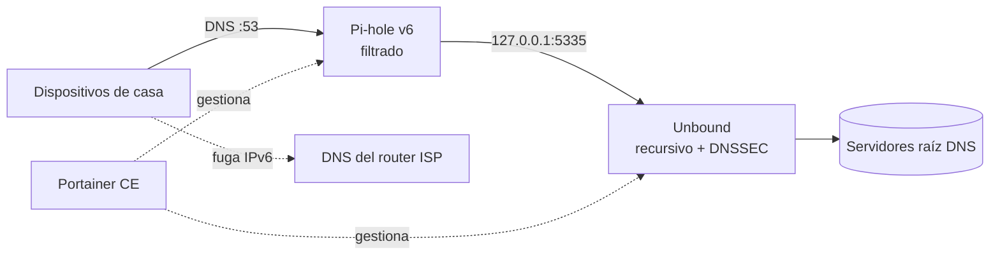

# MINISOC: homelab de ciberseguridad

Laboratorio doméstico en el que diseño, despliego, **verifico** y documento controles de seguridad reales sobre una Raspberry Pi 4. El objetivo es practicar el trabajo diario de un analista SOC: detectar puntos ciegos, validar que los controles ven el tráfico, investigar hallazgos y documentarlos.

> Cada cambio sigue el mismo ciclo: **desplegar aislado → validar → integrar → verificar de extremo a extremo → documentar**, siempre con un plan de rollback.

## Arquitectura actual



| Componente | Función | Estado |
|---|---|---|
| Raspberry Pi 4 (8 GB), Debian 12 | Host de Docker | ✅ Parcheado |
| Pi-hole v6 | Sinkhole DNS: publicidad, rastreo y amenazas | ✅ |
| Unbound | Resolución recursiva sin terceros, validación DNSSEC | ✅ |
| Portainer CE | Gestión de contenedores | ✅ (pendiente de hardening) |

### Listas de bloqueo

| Lista | Propósito |
|---|---|
| StevenBlack hosts | Base de publicidad y malware |
| Hagezi Pro | Publicidad, rastreo y telemetría |
| Hagezi TIF | Threat intelligence: malware, phishing y C2 |
| Hagezi DoH/VPN/Proxy bypass | Impedir la evasión del DNS mediante DoH |

## Hallazgos documentados

Cada hallazgo sigue el formato de un informe: evidencia, análisis, impacto, remediación y verificación.

| ID | Hallazgo | Severidad | Estado |
|---|---|---|---|
| [HL-001](docs/hallazgos/HL-001-fuga-dns-ipv6.md) | Fuga de DNS por IPv6: el router del ISP anuncia su propio DNS | Alta | Mitigado parcialmente |
| [HL-002](docs/hallazgos/HL-002-parche-no-aplicado.md) | Kernel parcheado en disco pero vulnerable en memoria | Media | Resuelto |
| [HL-003](docs/hallazgos/HL-003-evasion-dns-iphone.md) | Evasión del DNS en iOS mediante cifrado (iCloud Private Relay) | Media | En investigación |

## Runbooks

- [Verificación del filtrado DNS por dispositivo](docs/runbooks/verificacion-dns.md)

## Competencias demostradas

- **Seguridad de red:** DNS, DNSSEC, IPv6 (SLAAC/RDNSS), evasión mediante DoH/DoT y relays cifrados
- **Gestión de vulnerabilidades:** parcheo, diferencia entre parche instalado y aplicado
- **Análisis de logs y threat hunting:** correlación endpoint ↔ sensor, detección por ausencia de eventos
- **Gestión del cambio:** despliegue aislado, pruebas, rollback, backups verificados (regla 3-2-1)
- **Contenedores:** Docker, Compose, Portainer, principio de mínimo privilegio
- **Gestión de secretos:** ningún secreto en el repositorio; variables en `.env` excluido

## Hoja de ruta

- [x] Filtrado DNS con Pi-hole + Unbound + DNSSEC
- [x] Parcheo del sistema y limpieza
- [x] Backups verificados de Pi-hole y Portainer
- [ ] Cerrar la fuga IPv6 en toda la red (router neutro con OpenWrt/OPNsense)
- [ ] Hardening del host: SSH con claves, UFW, `unattended-upgrades`, mínimo privilegio
- [ ] Migración del sistema a SSD
- [ ] Detección y respuesta: CrowdSec
- [ ] Observabilidad: Grafana + Prometheus + Loki (mini-SIEM)
- [ ] Segmentación de red con VLANs (IoT / invitados / confianza)

## Estructura del repositorio

```
stacks/        Docker Compose de cada servicio (sin secretos)
docs/hallazgos Informes de hallazgos
docs/runbooks  Procedimientos de verificación y operación
```

## Aviso

Las direcciones IP son de una red privada doméstica. El repositorio no contiene contraseñas, claves ni backups.
